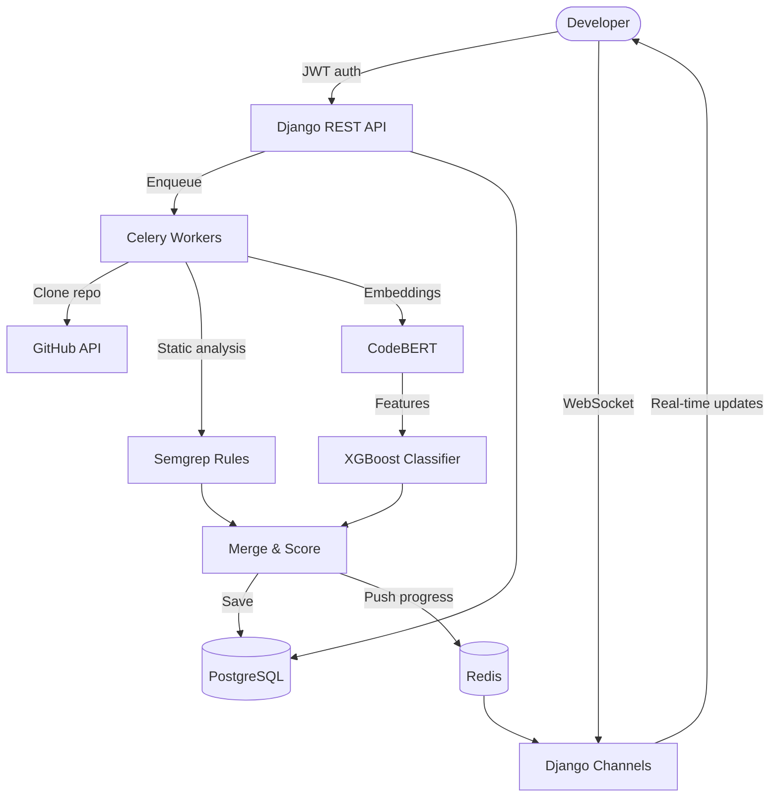

```
   ██████╗ ██████╗ ██████╗ ███████╗███████╗███████╗███╗   ██╗████████╗██╗███╗   ██╗███████╗██╗
  ██╔════╝██╔═══██╗██╔══██╗██╔════╝██╔════╝██╔════╝████╗  ██║╚══██╔══╝██║████╗  ██║██╔════╝██║
  ██║     ██║   ██║██║  ██║█████╗  ███████╗█████╗  ██╔██╗ ██║   ██║   ██║██╔██╗ ██║█████╗  ██║
  ██║     ██║   ██║██║  ██║██╔══╝  ╚════██║██╔══╝  ██║╚██╗██║   ██║   ██║██║╚██╗██║██╔══╝  ██║
  ╚██████╗╚██████╔╝██████╔╝███████╗███████║███████╗██║ ╚████║   ██║   ██║██║ ╚████║███████╗███████╗
   ╚═════╝ ╚═════╝ ╚═════╝ ╚══════╝╚══════╝╚══════╝╚═╝  ╚═══╝   ╚═╝   ╚═╝╚═╝  ╚═══╝╚══════╝╚══════╝
```

# CodeSentinel

**AI-powered code review and security vulnerability scanner.** Analyzes Python repositories using a combination of Semgrep static analysis rules and a CodeBERT + XGBoost ML pipeline to detect security vulnerabilities in real time.

[](https://github.com/your-org/codesentinel/actions)


> *Stop shipping vulnerabilities. Start shipping confidence.*

---

## Architecture



---

## Quick Start (5 commands)

```bash
git clone https://github.com/your-org/codesentinel.git
cd codesentinel
cp .env.example .env          # add your GITHUB_CLIENT_ID / SECRET
make setup                    # builds images, runs migrations, seeds demo data
make dev                      # starts all services
open http://localhost          # login as demo@codesentinel.dev / DemoPass123!
```

---

## Stack

| Layer | Technology |
|-------|-----------|
| Backend | Python 3.11, Django 4.2, Django REST Framework |
| Async | Celery + Redis, Django Channels (WebSocket) |
| Database | PostgreSQL 15 + Drizzle ORM |
| ML | CodeBERT (microsoft/codebert-base), XGBoost |
| Static Analysis | Semgrep with custom OWASP Top 10 rules |
| AST Parsing | Tree-sitter (Python) |
| Frontend | React 18 + TypeScript, Vite, TailwindCSS |
| State | Zustand + React Query v5 |
| Charts | Recharts |
| Code View | Monaco Editor |
| Infrastructure | Docker Compose, Nginx, Gunicorn |
| CI/CD | GitHub Actions |

---

## ML Model Details

### Dataset
- **Big-Vul**: ~27,000 labeled C/Python functions from real CVEs
- **Devign**: 27,318 vulnerable/safe C functions
- **PyGoat**: Intentionally vulnerable Python (OWASP)
- **Bandit benchmark**: Python security test cases

### Training Pipeline

1. Extract **CodeBERT embeddings** (768-dim) from function-level code blocks
2. Extract **50 hand-crafted AST features** (SQL injection patterns, subprocess calls, pickle usage, etc.)
3. Concatenate to an **818-dimensional feature vector**
4. Train **XGBoost binary classifier** with Optuna hyperparameter search (50 trials)
5. Train **XGBoost multi-class severity scorer** (critical / high / medium / low)

### Model Metrics (target thresholds)

| Metric | Target | Notes |
|--------|--------|-------|
| Precision | ≥ 0.82 | Vulnerability classifier |
| Recall | ≥ 0.78 | Vulnerability classifier |
| F1 | ≥ 0.80 | Vulnerability classifier |
| Severity Accuracy | ≥ 0.74 | 4-class scorer |

### Key Design Decisions

1. **CodeBERT over GPT**: CodeBERT was pre-trained on 6 programming languages with MLM and replaced token detection, making its embeddings more discriminative for code vulnerabilities.
2. **Semgrep + ML hybrid**: Semgrep provides high-precision rule-based detection; the ML model catches novel patterns. The merged results outperform either in isolation.
3. **Celery for scans**: Scans take 30s–5min. Async Celery tasks provide retry logic, progress tracking, and horizontal scaling.
4. **XGBoost scale_pos_weight**: The dataset is ~94% safe / 6% vulnerable. Using `scale_pos_weight` avoids SMOTE synthetic oversampling which can introduce distribution shift.
5. **React-Virtual for findings lists**: A single scan can produce thousands of findings. Only 20–30 rows are rendered at a time using list virtualization.

---

## Developer Guide

### Prerequisites
- Docker + Docker Compose
- `make`

### Commands

```bash
make setup      # First-time setup: builds images, migrates, seeds data
make dev        # Start all services (api + worker + frontend + nginx)
make logs       # Tail logs from all services
make shell      # Open Django shell inside the api container
make test       # Run pytest with 80%+ coverage requirement
make train-ml   # Train the ML models (needs dataset — see below)
make seed       # Re-seed demo data
make migrate    # Apply Django migrations
make stop       # Stop all services
make clean      # Remove containers and volumes (destructive)
```

### Training the ML Model

```bash
# 1. Download the Big-Vul dataset
mkdir -p data
wget -O data/bigvul.parquet https://github.com/ZeoVan/MSR_20_Code_vulnerability_CSV_Dataset/...

# 2. Run training (takes 20–60 min depending on CPU/GPU)
make train-ml

# Models are saved to ml/models/
# vulnerability_classifier.joblib
# severity_scorer.joblib
# model_metadata.json
```

### API Documentation

With the stack running:
- **Swagger UI**: http://localhost/api/docs/
- **Redoc**: http://localhost/api/redoc/
- **OpenAPI schema**: http://localhost/api/schema/
- **Celery Flower**: http://localhost:5555/

### Environment Variables

Copy `.env.example` to `.env` and configure:

| Variable | Description |
|----------|-------------|
| `DJANGO_SECRET_KEY` | Django secret key (generate with `python -c "import secrets; print(secrets.token_hex(50))"`) |
| `GITHUB_CLIENT_ID` | GitHub OAuth App client ID |
| `GITHUB_CLIENT_SECRET` | GitHub OAuth App client secret |
| `DATABASE_URL` | PostgreSQL connection string |
| `REDIS_URL` | Redis connection string |

---

## Contributing

1. Fork the repository
2. Create a feature branch: `git checkout -b feat/my-feature`
3. Commit with Conventional Commits: `git commit -m "feat: add SSRF detection rule"`
4. Push and open a Pull Request
5. CI must pass (lint + tests + security scan)

---

## License

MIT © CodeSentinel Contributors
